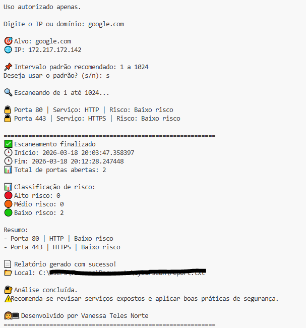

# 🔐 CyberScan - Scanner Inteligente de Portas

Projeto desenvolvido com foco em fundamentos de redes e segurança, realizando identificação de portas abertas e análise de risco.

## 🎯 Objetivo
Simular um cenário de análise de segurança, identificando serviços expostos e possíveis riscos em portas abertas.

## ⚙️ Funcionalidades
- Escaneamento de portas configurável
- Identificação de serviços conhecidos
- Classificação de risco (baixo, médio, alto)
- Geração automática de relatório
- Resumo analítico no terminal

## 📊 Execução

## 🧠 Destaque do projeto
O sistema realiza análise de portas abertas, classificando o nível de risco e gerando um relatório automático, simulando um cenário básico de auditoria de segurança.

## 🛠️ Tecnologias utilizadas
- Python
- Socket
- Redes
- Segurança da Informação

## 📌 Observação
Uso autorizado apenas em ambientes próprios ou com permissão.

---

👩‍💻 Desenvolvido por Vanessa Teles Norte